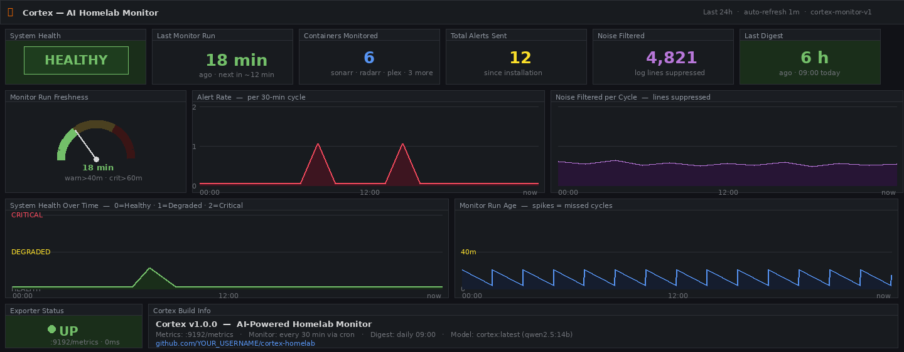

# 🧠 Cortex — AI-Powered Homelab Monitor

> Intelligent monitoring for self-hosted infrastructure. Cortex watches your Docker stack, analyses logs from your *arr services, and delivers daily digests — powered by a local LLM running on your own hardware.


---

## Why Cortex?

Most homelab monitoring tools watch numbers — CPU%, RAM, disk. Cortex watches *meaning*. Instead of alerting on thresholds, it reads your logs the way you would: understanding context, suppressing noise, and surfacing only what actually needs attention.

- **Semantic log analysis** — a local LLM reads your *arr logs, not just counts them
- **No cloud dependency** — Ollama runs on your hardware, your data stays in your network
- **Built for media stacks** — knows what Sonarr, Radarr, Prowlarr, and qBittorrent are actually telling you

---

## What is Cortex?

Cortex is a monitoring layer built specifically for homelab environments running Docker-based media stacks. It connects a local LLM (via Ollama) to your infrastructure, enabling:

- **Trend analysis** every 30 minutes across all running containers
- **Log analysis** for Sonarr, Radarr, Prowlarr, and other *arr services
- **Daily digest** pushed via ntfy with actionable summaries
- **Prometheus metrics** export for Grafana dashboards
- **Noise filtering** — only alerts that actually matter

Cortex is not a cloud service. Everything runs on your hardware. No telemetry, no subscriptions, no data leaving your network.

---

## Architecture

```
┌─────────────────────────────────────────────────────┐
│                   Your Homelab                      │
│                                                     │
│  Docker Stack ──► Cortex Monitor ──► Ollama (LLM)  │
│       │                  │                          │
│  *arr Logs          State File                      │
│       │                  │                          │
│       └──────────────────┼──► ntfy (notifications) │
│                          │                          │
│                    Prometheus ──► Grafana           │
└─────────────────────────────────────────────────────┘
```

**Components included in this repo (Free tier):**

| Component | Description |
|---|---|
| `cortex-monitor.py` | Core monitoring script, runs every 30 min via cron |
| `cortex-digest.py` | Daily summary generator, pushes to ntfy |
| `cortex-exporter.py` | Prometheus metrics exporter (port 9192) |
| `ai-gateway/` | Docker Compose — HTTP gateway to Ollama |
| `grafana/` | Dashboard JSON — 13 panels, ready to import |
| `modelfile/` | Ollama Modelfile for infrastructure-aware LLM |

---

## Screenshot



> *Grafana dashboard showing container health, alert trends, and daily digest history.*

---

## Requirements

- Linux host (Debian 12 / Ubuntu 22.04+ recommended)
- Docker + Docker Compose v2
- [Ollama](https://ollama.com/) running locally or on a GPU workstation
- Prometheus + Grafana (optional, for dashboards)
- ntfy instance (self-hosted or ntfy.sh)
- Python 3.10+

**Recommended hardware for LLM inference:**
- CPU-only: 16GB RAM minimum — runs `qwen2.5:7b` adequately
- GPU: 8GB VRAM — runs `qwen2.5:14b` comfortably (recommended)

**Tested on:** Debian 12.5, Docker 26.1, Ollama 0.3.x, Python 3.11

---

## Quick Start

**TL;DR:** clone the repo → pull the model → copy `cortex.conf.example` → set your container names and API keys → install the cron jobs. Done in ~15 minutes.

---

### 1. Clone the repository

```bash
git clone https://github.com/pdegidio/cortex-homelab.git
cd cortex-homelab
```

### 2. Pull the LLM model

```bash
ollama pull qwen2.5:14b-instruct
```

### 3. Create the infrastructure-aware modelfile

```bash
cd modelfile/
ollama create cortex -f Modelfile
```

### 4. Configure your environment

```bash
cp config/cortex.conf.example config/cortex.conf
nano config/cortex.conf
```

Key settings to update:

```ini
# Ollama endpoint (local or remote GPU workstation)
OLLAMA_HOST=http://192.168.1.x:11434
OLLAMA_MODEL=cortex:latest

# ntfy configuration
NTFY_URL=http://your-ntfy-instance:8090
NTFY_TOPIC=homelab-system

# Container names to monitor (space-separated)
MONITORED_CONTAINERS="sonarr radarr prowlarr qbittorrent plex"

# *arr API keys
SONARR_URL=http://localhost:8989
SONARR_API_KEY=your_key_here
RADARR_URL=http://localhost:7878
RADARR_API_KEY=your_key_here
```

### 5. Deploy the AI gateway

```bash
cd ai-gateway/
docker compose up -d
```

### 6. Install monitoring scripts

```bash
cp scripts/*.py /opt/scripts/
chmod +x /opt/scripts/cortex-*.py
```

### 7. Configure cron jobs

```bash
crontab -e
```

Add the following:

```cron
# Cortex — AI monitoring every 30 minutes
*/30 * * * * /usr/bin/python3 /opt/scripts/cortex-monitor.py >> /var/log/cortex.log 2>&1

# Cortex — Daily digest at 09:00
0 9 * * * /usr/bin/python3 /opt/scripts/cortex-digest.py >> /var/log/cortex-digest.log 2>&1

# Cortex — Prometheus exporter (keep alive)
@reboot /usr/bin/python3 /opt/scripts/cortex-exporter.py &
```

> **Note:** The `@reboot` cron entry works for most setups. For production or always-on environments, a systemd service unit is more reliable — see `docs/systemd-exporter.service` for a ready-to-use template.

### 8. Import Grafana dashboard

In Grafana → Dashboards → Import → Upload JSON file → select `grafana/cortex-monitor.json`

---

## Noise Filtering

Cortex ships with a pre-configured noise filter that suppresses known non-actionable log entries. The default filter list covers:

- ffprobe metadata read operations
- VideoFileInfoReader routine scans
- HTTP 429 rate limiting from indexers
- Invalid torrent file warnings
- Prowlarr 9696/ health check noise

The filter list is fully customisable in `config/cortex.conf`:

```ini
NOISE_PATTERNS="ffprobe,VideoFileInfoReader,429,invalid torrent,9696/"
```

---

## Prometheus Metrics

The exporter exposes the following metrics on port `9192`:

| Metric | Description |
|---|---|
| `cortex_alerts_total` | Total alerts generated |
| `cortex_last_run_timestamp` | Unix timestamp of last monitor run |
| `cortex_containers_monitored` | Number of containers under watch |
| `cortex_digest_last_sent` | Unix timestamp of last digest |
| `cortex_noise_filtered_total` | Log entries suppressed by noise filter |

---

## Directory Structure

```
cortex-homelab/
├── ai-gateway/
│   └── docker-compose.yml
├── config/
│   └── cortex.conf.example
├── docs/
│   ├── screenshot-dashboard.png
│   └── systemd-exporter.service
├── grafana/
│   └── cortex-monitor.json
├── modelfile/
│   └── Modelfile
├── scripts/
│   ├── cortex-monitor.py
│   ├── cortex-digest.py
│   └── cortex-exporter.py
└── README.md
```

---

## Upgrading to Cortex Core / Pro

The free tier covers AI monitoring. The full Cortex stack includes:

**Cortex Core** — Complete *arr + VPN media stack
- Pre-configured Docker Compose for Sonarr, Radarr, Prowlarr, qBittorrent + Gluetun VPN
- Authelia 2FA + NGINX Proxy Manager with 22 pre-configured proxy hosts
- ntfy integration for all *arr apps, Tautulli, Uptime Kuma
- 30+ documented gotchas and fixes (Docker subnet exhaustion, HE-AAC remux, Gluetun network namespace, and more)
- Full README in English and Italian

**Cortex Pro** — Core + AI monitoring, fully integrated
- Everything in Core
- Everything in this repo, pre-wired to the full stack
- Grafana dashboard bundle (media, system, AI monitoring)
- Custom Ollama Modelfile with baked-in infrastructure knowledge
- Step-by-step setup guide from zero to fully operational

Available at: **[paolodegidio.gumroad.com/l/cortex-homelab](https://paolodegidio.gumroad.com/l/cortex-homelab)**

---

## Contributing

Issues and pull requests are welcome. If you find Cortex useful, consider starring the repo — it helps others find it.

---

## License

MIT — use it, modify it, ship it. Attribution appreciated but not required.
